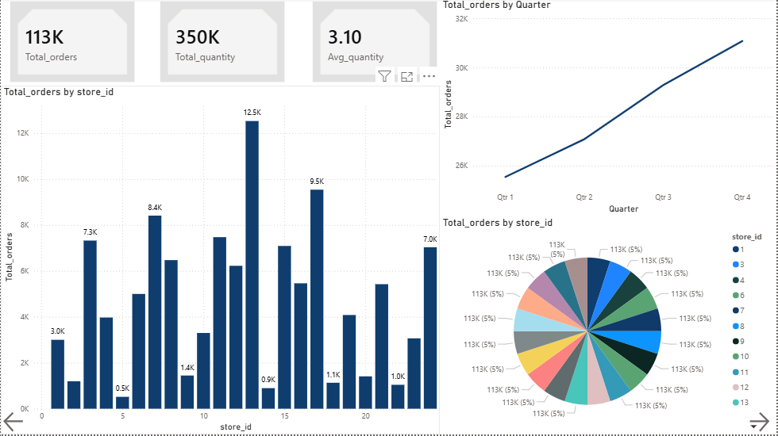
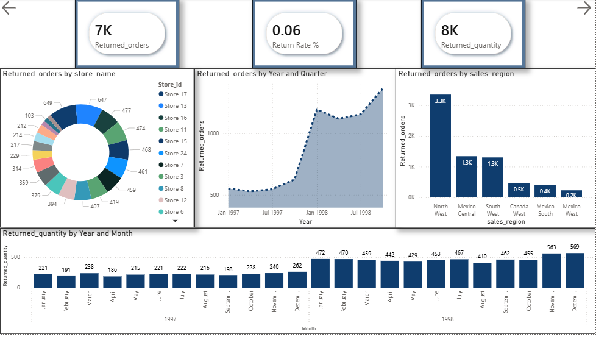
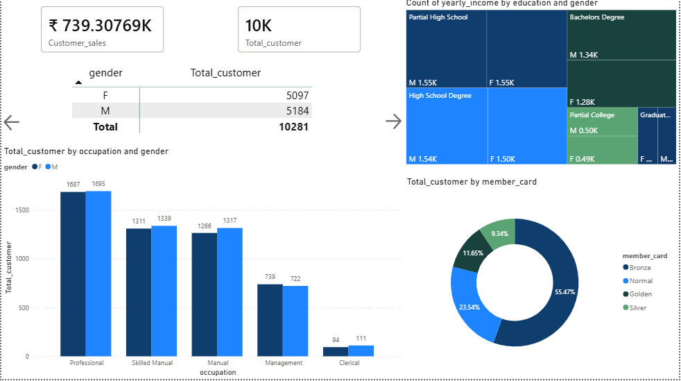
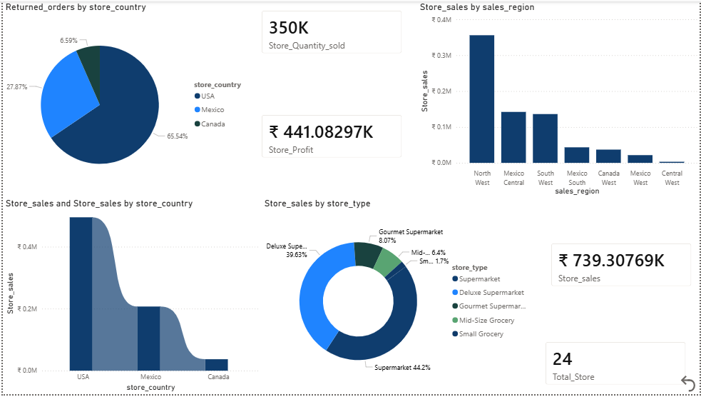

# 📊 Maven Market Power BI Dashboard

## 📌 Project Overview

Maven Market Power BI Dashboard is a Business Intelligence project created to analyze retail business performance.

The dashboard provides meaningful insights into sales trends, customer behavior, order performance, product returns, and store operations using interactive Power BI reports.

---

## 🚀 Dashboard Pages

### 1. 📈 Sales Analysis Dashboard

Analyzes overall business sales performance.

**Key Insights:**
- Total Sales
- Total Profit
- Total Orders
- Products Sold
- Monthly Sales Trend
- Top Performing Products
- Store-wise Sales
- Region-wise Sales Analysis

  

---

### 2. 🛒 Orders Overview Dashboard

Provides insights about customer orders and product demand.

**Key Insights:**
- Total Orders
- Total Quantity Ordered
- Average Quantity Per Order
- Monthly Order Trends
- Product-wise Orders
- Store-wise Order Analysis


---

### 3. 🔄 Returns Analysis Dashboard

Tracks product returns and return patterns.

**Key Insights:**
- Returned Orders
- Returned Quantity
- Return Rate %
- Monthly Return Trends
- Returned Product Analysis
- Store and Region-wise Returns
  

---

### 4. 👥 Customer Insights Dashboard

Analyzes customer demographics and purchasing behavior.

**Key Insights:**
- Total Customers
- Customer Segmentation
- Membership Analysis
- Gender Distribution
- Occupation-wise Sales
- Customer Income Analysis


---

### 5. 🏪 Store Performance Dashboard

Analyzes store-level business performance.

**Key Insights:**
- Total Stores
- Store Sales Performance
- Store Profit Analysis
- Regional Performance
- Quantity Sold
- Store Return Analysis


---

## 🛠 Tools & Technologies Used

- Microsoft Power BI
- Power Query Editor
- DAX (Data Analysis Expressions)
- Data Modeling
- Data Visualization
- CSV Data Processing

---

## 🗂 Dataset Tables

The data model contains:

- Transactions
- Customers
- Products
- Stores
- Regions
- Returns
- Calendar

---

## 🔗 Data Model

Relationships created:

- Transactions → Products
- Transactions → Customers
- Transactions → Stores
- Stores → Regions
- Returns → Products
- Calendar → Transactions

---

## 📐 DAX Measures

Some important measures:

### Total Sales

```DAX
Total Sales =
SUMX(
    Transaction,
    Transaction[quantity] *
    RELATED(Products[retail_price])
)
```

### Total Orders

```DAX
Total Orders =
COUNTROWS(Transaction)
```

### Returned Orders

```DAX
Returned Orders =
COUNTROWS(Returns)
```

### Return Rate %

```DAX
Return Rate % =
DIVIDE(
    [Returned Orders],
    [Total Orders],
    0
)
```

---

## 📊 Dashboard Features

✔ Interactive Reports  
✔ Dynamic Filters  
✔ KPI Cards  
✔ Sales Trend Analysis  
✔ Customer Segmentation  
✔ Store Performance Tracking  
✔ Return Monitoring  

---

## 📚 Learning Outcomes

Through this project I learned:

- Creating professional Power BI dashboards
- Cleaning data using Power Query
- Building relationships between tables
- Writing DAX calculations
- Creating business insights from raw data
- Designing interactive BI reports

---

## 📂 Project Files

```
Maven-Market-PowerBI-Dashboard

│── Dataset/
│── Dashboard Screenshots/
│── Maven Market Dashboard.pbix
│── README.md
```

---

## 👩‍💻 Author

**Sakshi Desai**

---

⭐ If you like this project, don't forget to star the repository.
